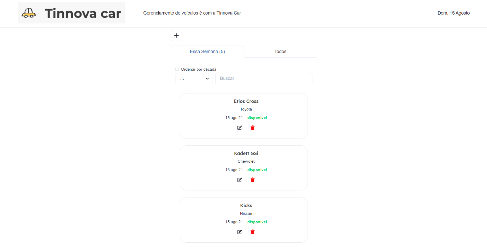
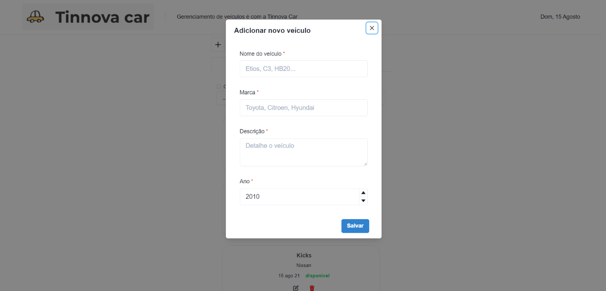

## Tinnova Backend (tinnova-challenge-api)

API do desafio da Tinnova que gerencia o cadastro de veículos

O Backend foi desenvolvido utilizando:
- Java 11
- Spring Boot
- H2 para dados in-memory a fim de agilizar a validação do desafio
- Swagger
- Maven
- Lombok

### Detalhes do front

- URL local: [http://localhost:8080](http://localhost:8080)

### Endpoints da API
`GET /veiculos` 
`GET /veiculos/{id}` 
`GET /veiculos/nome` 
`GET /veiculos/marca` 
`GET /veiculos/ano` 
`GET /veiculos/vendido` 

`POST /veiculos` 

`PUT /veiculos/{id}` 

`PATCH /veiculos/{id}` 

`DELETE /veiculos{id}` 

### Pré-requisitos

- Instalar e configurar o Lombok para o eclipse

### Inicializar o projeto

- Abra o Eclipse
- Importe o projeto **tinnova-challenge-api**, lembrando de importar como "Existing Maven Project" 
- Clique com o botão direito no projeto > **Run as** > **Spring Boot Application**
- Aguarde o projeto iniciar

---

## Tinnova FrontEnd (tinnova-vehicle-ui)

<h4 align="center">
    Interface do desafio que consome dados da API de veículos
</h4>

Tela Inicial               |  Cadastro de veículo
:-------------------------:|:-------------------------:
  |  

### Detalhes do front

- Link para a API integrada com o front: [tinnova-challenge-api](https://github.com/AddamC/tinnova-challenge-api)
- URL local: (localhost:3000/)
- Desenvolvida em **Next** usando **Typescript**
- Para os componentes da interface, foi utilizada a biblioteca [Chakra-ui](https://github.com/chakra-ui/chakra-ui)

### Pré-requisitos

Para a aplicação funcionar devidamente, é necessário que o backend esteja rodando

### Inicializar o projeto

Na pasta do projeto tinnova-challenge-ui utilizando um terminal de sua escolha execute os comandos abaixo:

- `yarn install`
- `yarn next dev`

O app será aberto em modo de desenvolvimento em sua máquina local no navegador padrão. 
[http://localhost:3000](http://localhost:3000).